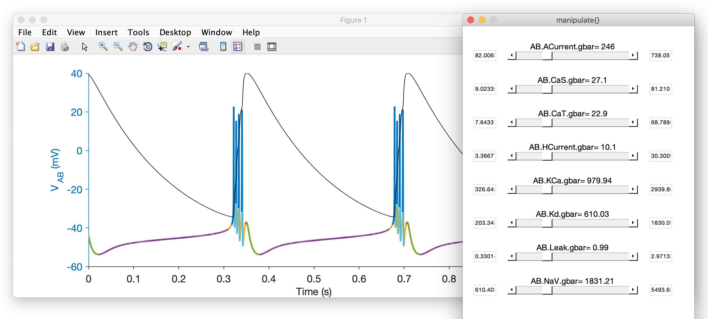

In this tutorial we will use the built-in demos in `xolotl` to see what 
it can do, and to play with some models. We assume that you have installed
`xolotl` correctly, and have verified your installation. If you haven't
done that already, [click here and complete the steps on that page first](./start-here.md). 

First, let's go to the folder that contains

```
xolotl.go_to_examples
demo_bursting_neuron
```


You should see this plot appear: 


You can see what effect changing the maximal conductances has on the voltage dynamics by running:

```
x.manipulate('*gbar')
```

This GUI will appear with sliders for maximal conductances of all the channels in the model. Try moving them around and seeing what happens with the voltage dynamics. 



To see how this model was created, and to use this as a template for your own projects, type:

```
edit demo_bursting_neuron.m
```

