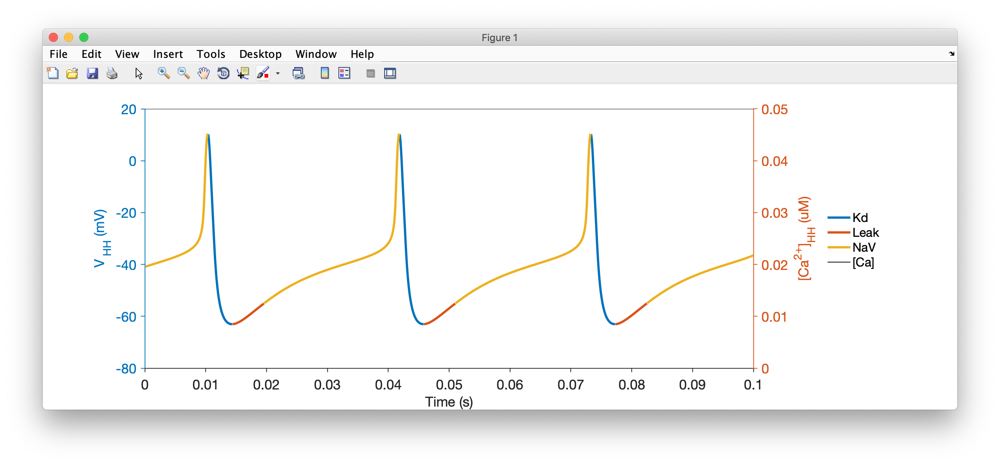

In this tutorial, we will walk through the process of creating a model of a single neuron, inserting some conductances in it, and integrating it and viewing its output.

### A high-level view of a neuron

A simple description of a neuron is to imagine that it a small spherical object, so that it can be described well be a single membrane voltage, whose dynamics are governed by populations of ion channels in the cell, as illustrated in the schematic below:


### Implementing this in xolotl

Note that this description of a neuron imposes a natural hierarchy to the things in our model: the soma *contains* various populations of ion channels. We will create a model in xolotl that looks like this:

  

See that the `compartment` object contains the three populations of ion channels, just like in our description of the neuron?

To set up this model, the first thing we will do is create a new xolotl object:

```matlab
x = xolotl;
```

### Making a compartment

By convention, this variable will be called `x`, though you can call it whatever you want. Now, let's build up out model from the outside in. First, let's make a new compartment and add it:


```matlab
x.add('compartment','HH','A',.01);
```

Here, we are creating a new object of type `compartment`, setting its surface area `A` to .01 $mm^2$, naming it `HH` (for Hodgkin-Huxley), and adding it to our xolotl object, all in one line.

If you look at your xolotl object by typing `x` in the MATLAB prompt, you should see something like this:

```matlab
 xolotl object with
---------------------
+ HH  
---------------------
```

This tells you that there is only one compartment, and that it's called "HH", and there is nothing in it.

### Adding channels to our compartment

A compartment is pretty boring by itself. Let's add some voltage-gated channels to it to give it some excitability (no pun intended).

To do this, we type:

```matlab
x.HH.add('liu/NaV', 'gbar', 1e3, 'E', 30);
x.HH.add('liu/Kd', 'gbar', 300, 'E', -80);
x.HH.add('Leak', 'gbar', 1);
```

What's going on here? In each line, we are specifying the thing that we want to add to `HH`, and we are specifying some parameters of the thing we're adding using name value syntax.

Let's break this up by focusing on the first line. We're adding a component that is specified by the string `liu/NaV` to `HH`. This is a voltage gated Sodium conductance. We're setting its maximal conductance to 1000 uS/mm^2, and its reversal potential to 30mV and adding it to the model. The same logic works for the other two lines.

When we look at our model by typing `x`, we see:


```matlab
xolotl object with
---------------------
+ HH  
  > Kd (g=300, E=-80)
  > Leak (g=1, E=-55)
  > NaV (g=1000, E=30)
---------------------
```

Now we see that the compartment `HH` has three children, representing the three populations of ion channels that we added to it. We can see the maximum conductance (`g`) and the reversal potentials (`E`) of each channel type.

That's it! Let's integrate it and see what it does.

### Integrating the model

To integrate the model and plot the voltage, we type:

```matlab
x.t_end = 100; % ms
x.plot;
```

You should see something like this:


Hmm. That's very boring. This neuron isn't doing anything. Let's inject some current into it and see if it does something.

```matlab
x.I_ext = .2; %nA
x.plot
```



We see that the neuron now spikes regularly.

!!! Note "What's with the colors?"
    The voltage trace is coloured by the dominant current at that time. When the voltage is increasing, the color corresponds to the largest inward current. When the voltage is decreasing, the color corresponds to the largest outward current. Here, you can see that the upswing of each action potential is dominated by Sodium currents, while the repolarization is caused by Potassium currents.

### Interacting with the simulation

`xolotl` allows you to manipulate every single parameter in the model and view what effect it has on your model. For example, if we wanted to manipulate the maximal conductances of every channel in this neuron, we can do so using:

```matlab
x.manipulate('*gbar')
```

and a window like this should pop up:

<video width="100%" autoplay loop muted>
  <source src="https://xolotl.readthedocs.io/en/master/images/manipulate-neuron.mp4" type="video/mp4">
  <source src="https://xolotl.readthedocs.io/en/master/images/manipulate-neuron.webm" type="video/webm">
Your browser does not support the video tag.
</video>

Play with the sliders and see how the voltage trace changes.
